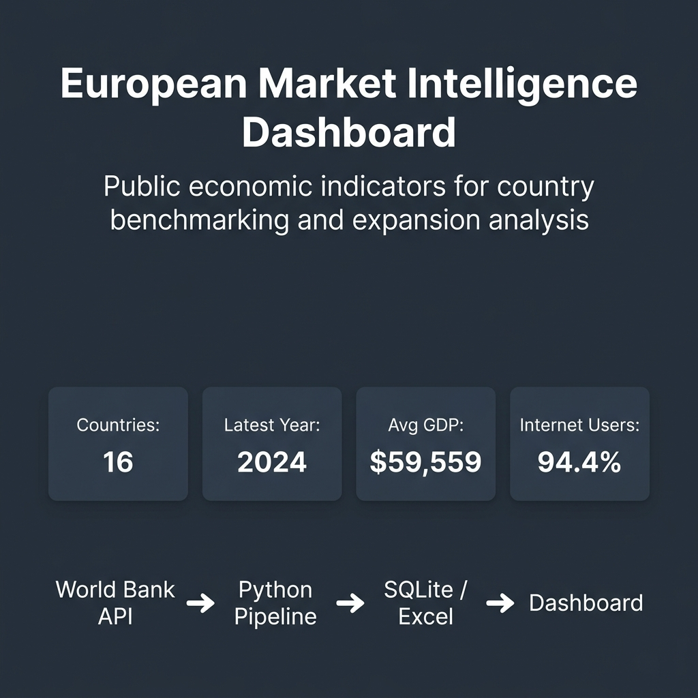
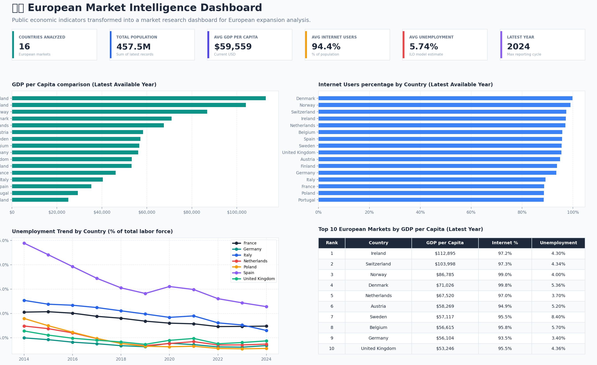

# European Market Intelligence Dashboard



A market intelligence dashboard built from public World Bank data to compare European countries across economic and digital indicators.

The project turns raw API data into clean CSV/Excel files, a local SQLite database and an interactive dashboard for country benchmarking, expansion analysis and executive reporting.

## What Was Delivered

- Automated World Bank API extraction
- Clean European market indicators dataset
- CSV and Excel reporting outputs
- SQLite database with structured market data
- Interactive Streamlit dashboard
- Country comparison view
- Historical indicator trends
- Market ranking tables
- Downloadable analysis files

## Dashboard Preview



## Project Outcome

The final dashboard allows users to compare European countries using indicators such as GDP per capita, population, unemployment, inflation, internet penetration and exports as a percentage of GDP.

It gives a quick view of market size, digital maturity, economic performance and country-level trends using reusable public data.

## Data Scope

Countries included:
Germany, France, Italy, Spain, Netherlands, Portugal, Poland, Sweden, Belgium, Austria, Denmark, Ireland, Finland, Norway, Switzerland and United Kingdom.

Indicators included:
GDP per capita, population, unemployment rate, inflation, internet users percentage and exports of goods and services as percentage of GDP.

## Data Pipeline

World Bank API → Python extraction → Raw JSON → Data cleaning → CSV / Excel / SQLite → Streamlit dashboard

## Key Features

- Multi-country European dataset
- Last 10+ years of economic indicators
- Long-format and dashboard-ready tables
- Country ranking by selected indicators
- Trend analysis by country and year
- Filterable dashboard views
- Exportable CSV and Excel files
- Local SQLite database for structured analysis

## Tech Stack

Python, Requests, Pandas, SQLite, Streamlit, Plotly, Excel, CSV, World Bank API

## Freelance Use Cases

This type of project can be adapted for:

- European market research
- Country benchmarking
- Expansion analysis
- Investment research dashboards
- Public data automation
- Economic indicator tracking
- Executive reporting
- Regional business intelligence

## Repository Structure

```
european-market-intelligence-dashboard/
├── app.py
├── requirements.txt
├── README.md
├── .gitignore
├── assets/
│   ├── project-cover.png
│   ├── dashboard-preview.png
│   └── fiverr_portfolio_text.md
├── data/
│   ├── processed/
│   │   ├── europe_market_indicators.csv
│   │   └── europe_market_indicators.xlsx
│   └── database/
│       └── europe_market.db (generated locally)
└── src/
    ├── extractor.py
    ├── transformer.py
    ├── database.py
    └── utils.py
```

## How to Run Locally

```powershell
python -m venv .venv
.venv\Scripts\activate
pip install -r requirements.txt
python src/extractor.py
python src/transformer.py
python src/database.py
streamlit run app.py
```
